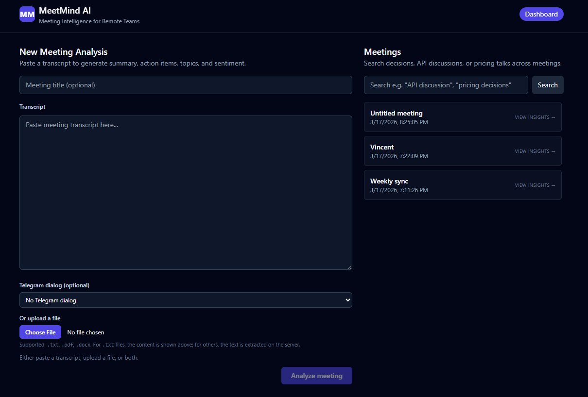
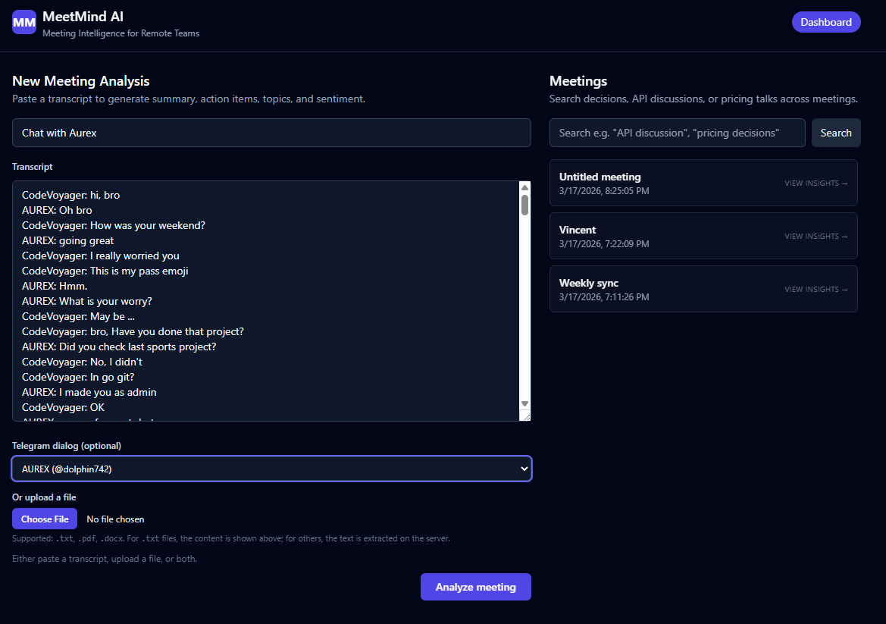
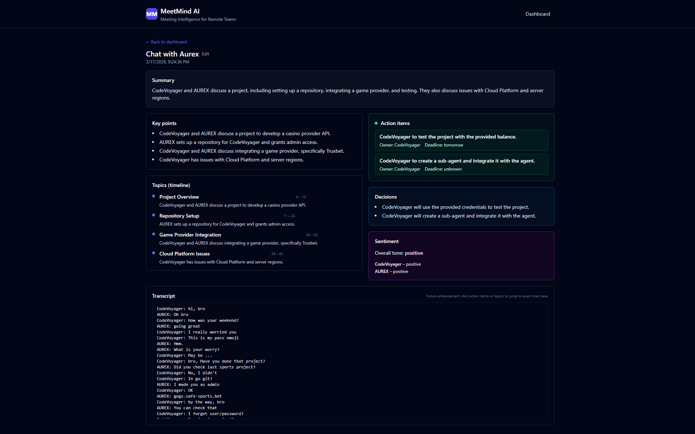

# MeetMind AI – Meeting Intelligence System



MeetMind AI turns raw meeting transcripts and Telegram chats into structured, searchable knowledge for remote teams, founders, PMs, sales, and agencies.

This repository contains:
- **FastAPI backend** (MongoDB + Groq AI + Telegram MTProto)
- **React + Vite frontend** (dashboard + meeting detail views)
- **Docker Compose stack** (MongoDB + backend + frontend)

---

## Tech Stack

- **Backend language**: Python (Docker image uses 3.11)
- **Backend framework**: FastAPI
- **Database**: MongoDB (`meetings`, `insights`, `embeddings` collections)
- **AI provider**: Groq AI (OpenAI-compatible chat API)
- **Telegram integration**: Telethon (MTProto API, user account login)
- **Frontend**: React + Vite + TypeScript + Tailwind CSS
- **Containerization**: Docker + Docker Compose

---

## Core Features

- **Transcript input**
  - Paste raw text
  - Upload `.txt`, `.docx`, `.pdf`
  - Load Telegram chat history and analyze as a meeting

- **AI processing engine**
  - Enforces a **strict JSON schema**:
    - `summary`
    - `key_points`
    - `action_items` (task / owner / deadline)
    - `decisions`
    - `topics` (topic segmentation with time / section spans)
    - `sentiment` (overall + per speaker)

- **Meeting dashboard (frontend)**
  - List of meetings
  - Search and filters
  - Meeting detail page with sections for summary, action items, decisions, topics, sentiment
  - Editable meeting title
  - File upload + Telegram dialog selector

---

## Environment Configuration

All configuration is driven by a `.env` file in the project root. **Never commit your real secrets.**

Use `.env.example` as a template:

```bash
cp .env.example .env
```

Key variables (see `.env.example` for the full list):

- **MongoDB**
  - `MONGODB_URL=mongodb://mongo:27017` (for Docker)
  - `MONGODB_URL=mongodb://localhost:27017` (for local Mongo)
  - `MONGODB_DB_NAME=meetmind`

- **Groq AI**
  - `GROQ_API_KEY=your_groq_api_key_here`  # real key only in `.env`
  - `GROQ_MODEL=llama-3.1-70b-versatile`   # or your preferred Groq model

- **Telegram (MTProto)**
  - `TELEGRAM_API_ID=...`
  - `TELEGRAM_API_HASH=...`
  - `TELEGRAM_SESSION_FILE=telegram.session`

- **Misc**
  - `BACKEND_PORT=8000` (optional)

`.env` is ignored by `.gitignore`. Keep **only placeholders** in `.env.example`.

---

## Running with Docker Compose (recommended)

This starts MongoDB, the FastAPI backend, and the React frontend together.

```bash
docker-compose up --build
```

Services:
- **MongoDB**: internal Docker network (`mongo:27017`)
- **Backend**: `http://localhost:8000` (FastAPI docs at `/docs`)
- **Frontend**: `http://localhost:3000`

The frontend is built with `VITE_API_URL=http://localhost:8000` so browser traffic goes directly to the backend.

---

## Running Backend Locally (without Docker)

1. **Create and activate virtual environment**

```bash
python -m venv .venv
.venv\Scripts\Activate.ps1   # Windows PowerShell
```

2. **Install dependencies**

```bash
pip install -r requirements.txt
```

3. **Start MongoDB**

- Run a local MongoDB server (e.g. Docker: `docker run -p 27017:27017 mongo:7`), and set `MONGODB_URL=mongodb://localhost:27017` in `.env`.

4. **Run FastAPI**

```bash
uvicorn app.main:app --reload --port 8000
```

API docs: `http://localhost:8000/docs`.

---

## Running Frontend Locally (without Docker)

From the `frontend` directory:

```bash
cd frontend
npm install
```

Create `frontend/.env` (or `.env.local`) with:

```bash
VITE_API_URL=http://localhost:8000
```

Then start Vite:

```bash
npm run dev -- --host
```

Frontend dev server: `http://localhost:5173` (or as printed in the console).

---

## Telegram MTProto Login (one‑time setup)

To use the Telegram dialog dropdown and analyze chats, you must create a **user session file** (`telegram.session`) in the project root.

1. **Install local dependencies for the login script** (if not using Docker):

```bash
pip install telethon python-dotenv
```

2. **Ensure Telegram env vars are set in `.env`**:

- `TELEGRAM_API_ID`
- `TELEGRAM_API_HASH`
- `TELEGRAM_SESSION_FILE=telegram.session`

3. **Run the login script**:

```bash
python scripts/telegram_login.py
```

Follow the prompts in the terminal (phone number, code, etc.). This will create `telegram.session` in the project root. Docker Compose mounts this file into the backend container so `/telegram/dialogs` and `/telegram/history` work.

---

## API Overview (backend)

- **`POST /analyze`**
  - Input: JSON body with raw transcript text (and optional Telegram metadata)
  - Output: structured insights JSON (`summary`, `key_points`, `action_items`, `decisions`, `topics`, `sentiment`)

- **`POST /analyze/file`**
  - Input: multipart form with `file` (`.txt`, `.docx`, `.pdf`) and optional metadata
  - Output: same structured insights JSON as `/analyze`

- **`GET /meetings`**
  - List stored meetings (basic metadata, titles, timestamps).

- **`GET /meetings/{id}`**
  - Full analysis (raw transcript + insights) for a single meeting.

- **`PATCH /meetings/{id}/title`**
  - Update a meeting’s title (used by the frontend inline editor).

- **`GET /search?q=...`**
  - Text-based search across stored meetings and insights (MongoDB aggregation).

- **`GET /telegram/dialogs`**
  - Returns available Telegram dialogs (chats) for the logged‑in user.

- **`GET /telegram/history`**
  - Returns formatted message history for a selected dialog (used as transcript input).

---

## Project Structure (high level)

```text
app/
  main.py              # FastAPI app, routers wiring, CORS
  config.py            # Settings (env-based via pydantic-settings)
  db/
    base.py            # MongoDB client and AsyncIOMotorDatabase
    models.py          # Collection names and document builders
  ai/
    pipeline.py        # Orchestrates full analysis + Mongo persistence
    client.py          # Groq AI client (OpenAI-compatible API)
    prompts.py         # Master prompt & sub-prompts
    schema.py          # Pydantic models / JSON schema validation
  routers/
    analyze.py         # /analyze, /analyze/file
    meetings.py        # /meetings, /meetings/{id}, title updates
    search.py          # /search
    telegram.py        # /telegram/dialogs, /telegram/history
  telegram_client.py   # Telethon client helper (session, dialogs, history)

frontend/
  src/
    api.ts             # Axios client + typed API helpers
    App.tsx            # App shell + routing
    pages/
      Dashboard.tsx    # Input form, file upload, Telegram selector, meetings list
      MeetingDetail.tsx# Meeting detail page with editable title
  Dockerfile           # Multi-stage build (Vite build + Nginx)

docker-compose.yml     # Mongo + backend + frontend stack
Dockerfile             # Backend Dockerfile
.env.example           # Env template (no real secrets)
```

---

## Screenshots

> Note: Update the image paths below to match your actual filenames/locations if they differ.

### Main dashboard


### Telegram chat loading



### Analyze UI



---

## Security Notes

- **Do not commit real API keys or secrets.**
- Keep real values only in `.env` (which is git‑ignored).
- `.env.example` should always contain **placeholders**, never real keys.
- If a secret is accidentally committed, rotate the key at the provider and recreate or rewrite git history before pushing (GitHub push protection will block leaked secrets).

